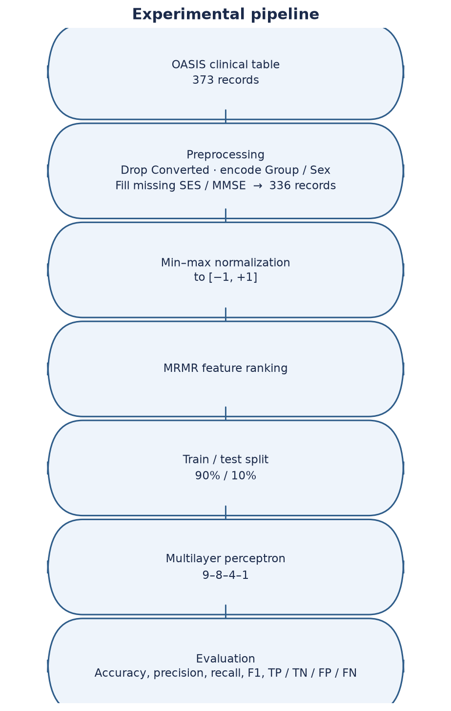
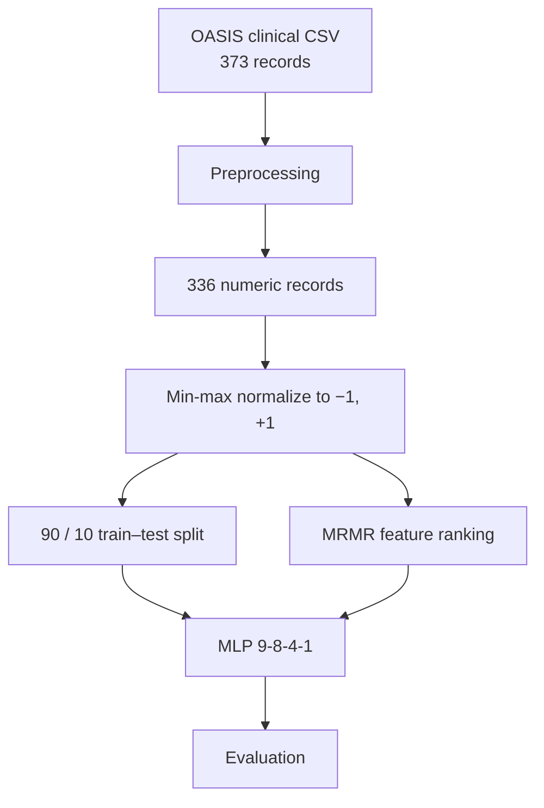

# Alzheimer's Disease Classification Using Neural Networks

[](python/pipeline.py)
[](matlab)
[](LICENSE)

Bachelor’s thesis project on **binary classification** of OASIS clinical records with a multilayer perceptron (MLP) and MRMR feature ranking.

This repository is a student research project. It is not a medical device, and the reported scores should not be read as evidence of clinical performance.

| Resource | Path |
| --- | --- |
| English thesis | [`docs/Bachelor_Thesis_English.docx`](docs/Bachelor_Thesis_English.docx) |
| Persian original | [`docs/original_thesis_persian.docx`](docs/original_thesis_persian.docx) |
| MATLAB pipeline | [`matlab/`](matlab/) |
| Python pipeline | [`python/pipeline.py`](python/pipeline.py) |
| OASIS clinical table | [`data/raw/oasis_clinical.csv`](data/raw/oasis_clinical.csv) |

---

## Academic Project

This repository contains the code, processed tables, figures, and thesis documents for my **Bachelor’s thesis** in **Information Technology** at Islamic Azad University, North Tehran Branch (2022).

- **Author:** Niloofar Dalir Abdinia
- **Supervisor:** Eng. Samaneh Yazdani
- **Original thesis title:** *Diagnosis of Alzheimer’s Disease Using Neural Networks*

The public title of this repository uses **classification** rather than diagnosis: the implemented model assigns the existing `Demented` / `Nondemented` labels in a public clinical table. It does not examine patients, order tests, or produce a clinical diagnosis.

---

## Research Question

The thesis addresses two related questions, using a public OASIS-derived clinical table rather than raw MRI:

1. Can a multilayer perceptron classify each record as **Demented** or **Nondemented** from the recorded clinical and morphometric features?
2. Which of those features does **MRMR** rank as most associated with the label, and does dropping the weakest features preserve test-set accuracy in this experimental setup?

Feature extraction from raw medical examinations is outside the scope of the work. The study uses an already annotated spreadsheet.

---

## Dataset

The input is the OASIS longitudinal **clinical** table (not MRI volumes), as used in the thesis and originally stored as `dataset1_orginal.csv`. The copy in this repository is [`data/raw/oasis_clinical.csv`](data/raw/oasis_clinical.csv), the Kaggle distribution of that clinical subset.

| Item | Documented value |
| --- | --- |
| Raw rows | 373 |
| Label values | Demented, Nondemented, Converted |
| Class counts (raw) | 146 Demented, 190 Nondemented, 37 Converted |
| Rows after dropping Converted | **336** |
| Class counts (used) | 146 Demented, 190 Nondemented |

Converted follow-up cases were removed because the task is binary presence versus absence of the recorded dementia label.

| Feature | Meaning |
| --- | --- |
| Group | Label: Demented (+1) or Nondemented (−1) |
| Sex (M/F) | Encoded +1 (male) / −1 (female) |
| Age | Age in years |
| EDUC | Years of education |
| SES | Socioeconomic status |
| MMSE | Mini-Mental State Examination |
| CDR | Clinical Dementia Rating |
| eTIV | Estimated total intracranial volume |
| nWBV | Normalized whole-brain volume |
| ASF | Atlas scaling factor |

If this dataset is reused, cite the OASIS project, for example Marcus et al., “Open Access Series of Imaging Studies (OASIS): Cross-sectional MRI data in young, middle aged, nondemented, and demented older adults,” *Journal of Cognitive Neuroscience*, 2007.

---

## Methodology

The implemented pipeline is:

**Dataset → Preprocessing → Normalization → Feature Selection → Train/Test → Neural Network → Evaluation**

<p align="center">
  
</p>



**Preprocessing.** Converted rows are dropped. `Group` and `M/F` are encoded as ±1. Missing SES is set to 0 and missing MMSE to 4, matching the original thesis preparation (19 SES values and 2 MMSE values among the retained rows).

**Normalization.** Every column is min–max scaled to `[−1, +1]`. The label and sex columns already lie in `{−1, +1}` and are unchanged by that transform.

**Feature selection.** MRMR ranks the nine predictors. The classifier is then re-run after dropping the weakest features (eTIV and ASF). The Python reproduction also reports an ablation without CDR. Ranking is computed on the full normalized table before the split, as in the original procedure.

**Train/test.** The intended split is 90% train / 10% test.

- **Python reproduction:** stratified 90/10 split, `random_state=42` → 302 train / 34 test.
- **Original MATLAB (2022):** `dividerand(n, 0.9, 0.1)` with two outputs. MATLAB treats those arguments as train / validation / test ratios, so the 10% “test” set was the validation index, the default 0.15 test share was unused, and about 13% of rows were discarded (263 + 29 = 292 of 336). The public MATLAB code in `matlab/` uses a true 90/10 split of every row.

**Neural network.** A 9-8-4-1 multilayer perceptron: nine inputs (seven after dropping eTIV and ASF), hidden layers of 8 and 4 neurons with tanh activations, and a linear output thresholded at 0. Labels are `+1` (Demented) and `−1` (Nondemented). Architecture width and depth were chosen by trial and error on this table.

- **MATLAB:** `newff` / `feedforwardnet` with Levenberg–Marquardt (`trainlm`). The corrected scripts set `divideFcn = 'dividetrain'` so the network does not split the already held-out data again.
- **Python:** `MLPRegressor` with hidden layers `(8, 4)`, tanh activation, and `lbfgs`, chosen to follow the MATLAB tansig / purelin pattern more closely than a softmax classifier.

---

## Feature Selection

MRMR (minimum redundancy, maximum relevance) is a **filter** ranking: it scores each input by relevance to the label while penalizing redundancy with features already chosen. The thesis uses it both to interpret which recorded variables co-vary with the label and to test whether the weakest columns can be removed.

- **MATLAB:** Statistics and Machine Learning Toolbox function `fscmrmr`.
- **Python:** a greedy ranking with F-statistic relevance and mean absolute correlation as redundancy.

In both implementations, **CDR** is ranked first and **MMSE** second. Intracranial-volume features **eTIV** and **ASF** receive near-zero scores. MATLAB ranking (original 2022 run): CDR, MMSE, Sex, SES, nWBV, EDUC, Age, eTIV, ASF. Python ranking (seed 42): CDR, MMSE, Sex, EDUC, nWBV, Age, eTIV, ASF, SES. The two rankers are not identical, but both put CDR and MMSE at the top and eTIV/ASF at the bottom.

CDR is a clinician-assigned dementia rating and is tightly aligned with the `Group` label. Treating it as an ordinary predictor inflates classification accuracy. That is why the Python pipeline also evaluates the network with CDR withheld.

<p align="center">
  
</p>

<p align="center"><em>Python MRMR ranking used in this repository. The original MATLAB bar chart is <a href="docs/figures/mrmr_scores.png">docs/figures/mrmr_scores.png</a>.</em></p>

---

## Model Evaluation

Positive class = Demented (`+1`). The original MATLAB listing swapped the names of false positives and false negatives; accuracy was still correct. The public MATLAB and Python code use the standard definitions.

| Quantity | Definition used here |
| --- | --- |
| TP | Demented record classified as demented |
| TN | Nondemented record classified as nondemented |
| FP | Nondemented record classified as demented |
| FN | Demented record classified as nondemented |
| Accuracy | (TP + TN) / (TP + TN + FP + FN) |
| Precision | TP / (TP + FP) |
| Recall | TP / (TP + FN) |
| F1 | 2 · precision · recall / (precision + recall) |

Specificity, `TN / (TN + FP)`, is also computed in the corrected MATLAB script and in the Python pipeline. Training time and test time were recorded for the original MATLAB runs.

No ROC/AUC, cross-validation, or external test cohort is reported in this project.

---

## Results

### Python reproduction

Stratified 90/10 split, seed 42, test set of **34** records. Numbers are stored in [`results/metrics.json`](results/metrics.json).

| Setting | Features | TP | TN | FP | FN | Accuracy | Precision | Recall | F1 |
| --- | --- | --- | --- | --- | --- | --- | --- | --- | --- |
| All features | 9 | 15 | 19 | 0 | 0 | 100% | 1.00 | 1.00 | 1.00 |
| Without eTIV and ASF | 7 | 15 | 19 | 0 | 0 | 100% | 1.00 | 1.00 | 1.00 |
| Without CDR | 8 | 13 | 16 | 3 | 2 | 85.3% | 0.81 | 0.87 | 0.84 |

**100% test accuracy was obtained on this dataset and split when CDR was included.** That figure describes classification of the held-out OASIS rows under this experimental setup. It is not evidence of clinical generalization, and it should not be read as “100% accurate Alzheimer’s detection.”

When CDR is removed, the same split yields **85.3%** accuracy. That is the result of this ablation on these remaining variables; it is not a claim about screening or clinical use.

<p align="center">
  
  
</p>

<p align="center"><em>Left: all nine features (including CDR). Right: CDR withheld. The matrix after dropping eTIV and ASF is <a href="results/confusion_reduced_features.png">results/confusion_reduced_features.png</a>.</em></p>

### Original MATLAB study (2022)

The thesis records ten runs on a **29-row** test file produced by the `dividerand` call above (22 nondemented, 7 demented). **Nine of ten runs printed 100% accuracy; one run printed 93.10%.** Three documented command-window listings:

| Metric | Run 1 | Run 2 | Run 3 |
| --- | --- | --- | --- |
| TP / TN | 5 / 22 | 7 / 22 | 7 / 22 |
| Printed FP / FN | 2 / 0 | 0 / 0 | 0 / 0 |
| Accuracy | 93.10% | 100% | 100% |
| Precision (printed) | 0.71 | 1.00 | 1.00 |
| Recall (printed) | 1.00 | 1.00 | 1.00 |
| F1 | 0.83 | 1.00 | 1.00 |

Screenshots: [`docs/figures/matlab_run1.png`](docs/figures/matlab_run1.png), [`matlab_run2.png`](docs/figures/matlab_run2.png), [`matlab_run3.png`](docs/figures/matlab_run3.png). After dropping eTIV and ASF, a recorded run still printed 100% accuracy ([`matlab_run_reduced.png`](docs/figures/matlab_run_reduced.png), 7-8-4-1 network).

Those MATLAB numbers are **not** directly comparable to the Python table: different splits, different test-set sizes, a discarded-row bug in the original split, and a different optimizer.

---

## Research Limitations

The following limits are part of the project as implemented, not extra claims about other datasets.

- **CDR is not an independent biomarker.** It is a clinician-assigned staging score tightly coupled to the diagnostic label. Including it as an ordinary predictor inflates accuracy on this table and does not show that the remaining features can replace a clinical assessment.
- **Held-out sets are small** (29 rows in the original MATLAB files, 34 in the Python split). A single 90/10 split can look optimistic.
- **No cross-validation or external cohort** is reported. All scores are on one OASIS-derived table.
- **Converted cases (37 rows) were excluded**, so uncertain follow-up labels are not part of the classification task.
- **Missing SES and MMSE were filled with constants** (0 and 4), not with a fitted imputation model.
- **MRMR was run on the full normalized table** before splitting, following the original thesis order.
- **The original MATLAB split discarded about 13% of rows.** The public `matlab/` folder corrects that behaviour; archived scripts in `archive/` do not.
- **MATLAB and Python results should not be pooled.** They differ in split, library, and training algorithm.
- **Scores are tied to this OASIS-derived table.** The thesis does not evaluate other cohorts, imaging-based CAD, or clinical deployment.

---

## Repository Structure

```text
matlab/                 Corrected MATLAB pipeline (edit, normalize, MRMR, split, MLP)
python/pipeline.py      End-to-end Python reproduction of the same steps
data/raw/               OASIS clinical CSV used in the thesis
data/processed/         Encoded, normalized, and split tables
results/                Python metrics JSON and confusion / MRMR figures
docs/                   English thesis, Persian original, thesis figures
docs/figures/           MATLAB screenshots, MRMR chart, methodology diagram
scripts/                Builders for the English thesis and the pipeline figure
archive/matlab_original/  2022 .m listings as submitted
```

| Path | Role |
| --- | --- |
| [`matlab/run_pipeline.m`](matlab/run_pipeline.m) | Runs the five MATLAB steps; retrains after dropping eTIV and ASF |
| [`python/pipeline.py`](python/pipeline.py) | Full reproduction, including the without-CDR ablation |
| [`results/metrics.json`](results/metrics.json) | Numeric Python results |
| [`archive/matlab_original/`](archive/matlab_original/) | Original `normalize.m`, `devide.m`, `fs.m`, `MLP.m` |
| [`CITATION.cff`](CITATION.cff) | Citation metadata |

---

## Reproducibility

Processed CSVs under `data/processed/` can be deleted and rebuilt.

### Python

```bash
python -m pip install -r requirements.txt
python python/pipeline.py
```

Writes `data/processed/*.csv`, `results/metrics.json`, and the figures in `results/`. Optional: `python python/pipeline.py --seed 42`.

A GitHub Actions workflow ([`.github/workflows/python.yml`](.github/workflows/python.yml)) runs the same command on push.

### MATLAB

Requires MATLAB R2021 or later, the Deep Learning Toolbox, and the Statistics and Machine Learning Toolbox (`fscmrmr`).

```matlab
cd matlab
run_pipeline
```

`mlp_classifier('DropFeatures', [7 9])` drops eTIV and ASF. The without-CDR setting is implemented in the Python script, not in `run_pipeline.m`.

The original 2022 listings used hard-coded ranges (`B1:J263`, `A1:A29`), obsolete `csvread` / `csvwrite` / `newff`, and the `dividerand` call described above. They remain in `archive/` for comparison. The English thesis also notes row-count typos in the original text (337 vs 336; “7 input neurons” vs the 9-input network in the screenshots).

---

## Academic Context

- **Degree:** Bachelor’s thesis
- **Field:** Information Technology, Faculty of Engineering, Department of Electrical Engineering and Computer Science
- **Institution:** Islamic Azad University, North Tehran Branch
- **Year:** 2022
- **Supervisor:** Eng. Samaneh Yazdani (named on the thesis cover)

```text
Niloofar Dalir Abdinia, “Diagnosis of Alzheimer’s Disease Using Neural Networks,”
Bachelor’s thesis, Islamic Azad University, North Tehran Branch, 2022.
```
