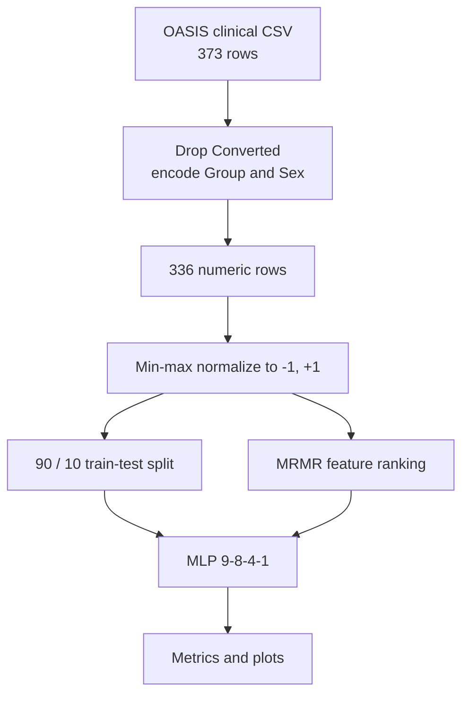
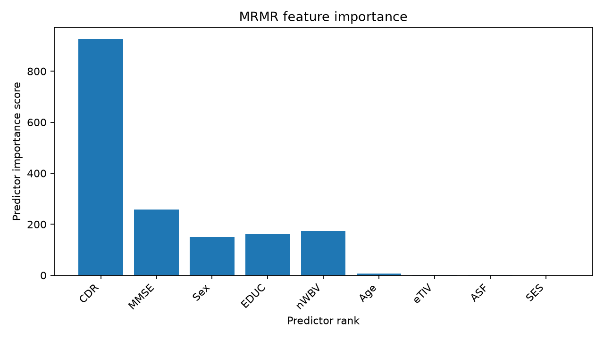
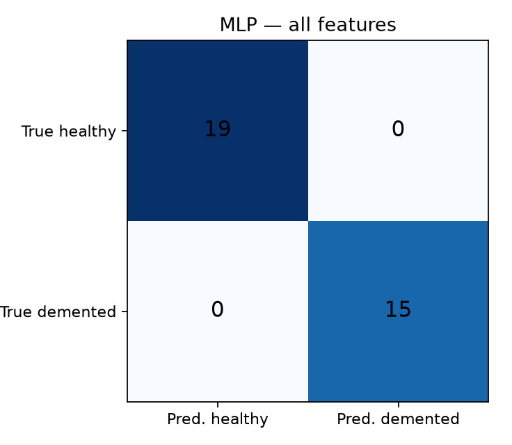
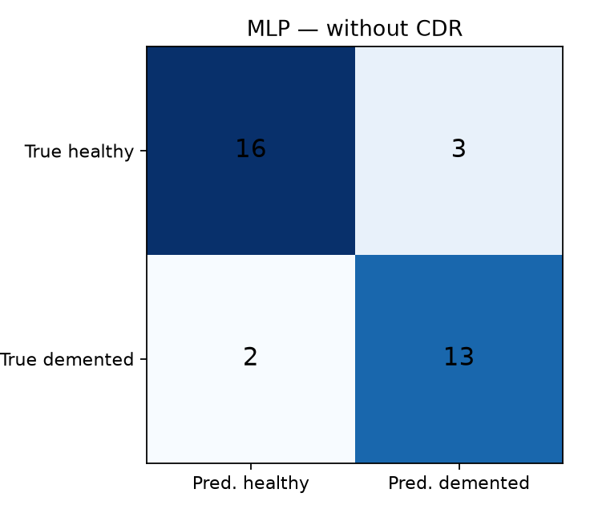

# Diagnosis of Alzheimer’s Disease Using Neural Networks

Bachelor’s thesis project in **Information Technology**  
Islamic Azad University, North Tehran Branch  
Author: **Niloofar Dalir Abdinia** · Supervisor: **Eng. Samaneh Yazdani**

[](python/pipeline.py)
[](matlab)
[](LICENSE)

A multilayer perceptron that classifies OASIS clinical records as **Demented** or **Nondemented**, with MRMR feature ranking. Clinical Dementia Rating (CDR) is treated as a documented limitation: it is nearly a diagnosis, not an independent biomarker.

This repository includes the MATLAB pipeline, a Python reproduction, processed data, results, and the thesis in English and Persian.

| Resource | Path |
| --- | --- |
| English thesis | [`docs/Bachelor_Thesis_English.docx`](docs/Bachelor_Thesis_English.docx) |
| Persian original | [`docs/original_thesis_persian.docx`](docs/original_thesis_persian.docx) |
| MATLAB pipeline | [`matlab/`](matlab/) |
| Python pipeline | [`python/pipeline.py`](python/pipeline.py) |
| Raw OASIS table | [`data/raw/oasis_clinical.csv`](data/raw/oasis_clinical.csv) |

---

## Method



**Network.** Two hidden layers (8 and 4 neurons), tanh activations, linear output thresholded at 0. Labels are `+1` (Demented) and `-1` (Nondemented).

**Features.** Sex, Age, EDUC, SES, MMSE, CDR, eTIV, nWBV, ASF.

---

## Results

Python reproduction, stratified 90/10 split, seed 42, test set of 34 records:

| Setting | Features | Accuracy | Precision | Recall | F1 |
| --- | --- | --- | --- | --- | --- |
| All features | 9 | **100%** | 1.00 | 1.00 | 1.00 |
| Without eTIV and ASF | 7 | **100%** | 1.00 | 1.00 | 1.00 |
| **Without CDR** | 8 | **85.3%** | 0.81 | 0.87 | 0.84 |

MRMR consistently ranks **CDR** then **MMSE** at the top. Intracranial-volume features (eTIV, ASF) contribute almost nothing.

<p align="center">
  
</p>

<p align="center">
  
  
</p>

The original MATLAB study (2022) reported 100% accuracy on 9 of 10 runs and 93.10% on one run, using a 29-row test file. Those screenshots are in the thesis. They are **not** directly comparable to the Python table above, because the old `dividerand` call accidentally dropped rows (see “What was fixed”).

---

## How to run

### Python

```bash
python -m pip install -r requirements.txt
python python/pipeline.py
```

Outputs land in `data/processed/` and `results/`.

### MATLAB

Requires MATLAB R2021 or later with the Deep Learning Toolbox and the Statistics and Machine Learning Toolbox (`fscmrmr`).

```matlab
cd matlab
run_pipeline
```

---

## What was fixed in the MATLAB code

The submitted thesis programs worked well enough to produce screenshots, but several defects would block a clean reproduction:

1. **`dividerand(n, 0.9, 0.1)` with two outputs** — MATLAB treats the arguments as train / validation / test. The missing test ratio defaults to 0.15, the 10% “test” set was actually the validation index, and about 13% of rows were thrown away (263 + 29 = 292 of 336).
2. **Hard-coded ranges** (`B1:J263`, `A1:A29`, `A1:J336`) — the scripts broke as soon as the split sizes changed.
3. **False positives and false negatives were swapped** in the metric loop. Accuracy was still correct; precision/recall names were not.
4. **`newff` / `csvread` / `csvwrite`** are obsolete. The public MATLAB code uses `feedforwardnet`, `readmatrix`, and `writematrix`, and disables a second internal data split (`divideFcn = 'dividetrain'`).
5. **No preprocessing script** — encoding of Group/Sex and the handling of missing SES/MMSE now live in `matlab/edit_dataset.m`.
6. **Row-count typos in the thesis text** (337 vs 336, “7 input neurons” vs the 9-input network in the screenshots) are corrected in the English document.

---

## Data

The table is the OASIS longitudinal clinical subset distributed on Kaggle (`Group`, `M/F`, `Age`, `EDUC`, `SES`, `MMSE`, `CDR`, `eTIV`, `nWBV`, `ASF`). Converted follow-up cases are removed. Missing SES is set to 0 and missing MMSE to 4, matching the original thesis preparation.

This is **not** a medical device and is not for clinical use.

---

## Repository layout

```text
matlab/                 Corrected MATLAB pipeline
python/pipeline.py      End-to-end Python reproduction
data/raw/               Original clinical CSV
data/processed/         Encoded, normalized, split tables
results/                Metrics JSON and figures
docs/                   English thesis, Persian original, figures
scripts/                Builder for the English .docx
archive/                Original .m files as submitted
```

---

## Citation

If you refer to this work:

```text
Niloofar Dalir Abdinia, “Diagnosis of Alzheimer’s Disease Using Neural Networks,”
Bachelor’s thesis, Islamic Azad University, North Tehran Branch, 2022.
```
